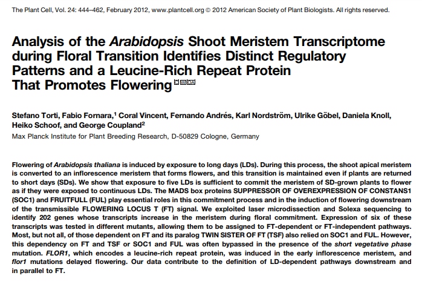

## PlantScience

     

     

     

### Introducción

La transcriptómica es una de las “ómicas” más estudiadas e importantes en la investigación científica,  que permite corroborar como se están expresando los genes en un determinado momento o estado de los seres vivos, es como una fotografía instantánea del momento de la expresión de genes bajo estudio. La forma más ampliamente usada para obtener datos transcriptómicos es usando tecnologías de secuenciamiento (RNA-Seq), que permite perfilar el transcriptoma, cuantificar la expresión génica y descubrir nuevas moléculas de ARN. Este taller utiliza la secuenciación de ARN de Arabidopsis thaliana.

### Finalidad

Familiarizar y acercar a los estudiantes, al uso del lenguaje R para análisis transcriptomicos; que les ayudará a una mejor interpretación y entendimiento de los diferentes artículos científicos dentro de esta área; así como iniciar proyectos usando datos propios. Este minicurso busca también ampliar la red de contactos de los participantes y motivar al estudio de transcriptomica dentro del área de Plant Scienc.

### Detalles del evento

|                          |                     |
|--------------------------|---------------------|
|Apertura de inscripciones | `14 de septiembre del 2021`|
|Cierre de inscripciones | `18 de septiembre del 2021`|
|Fecha de publicación de seleccionados | `18 de septiembre del 2021`|
|Fecha del evento	| `19 y 26 de septiembre del 2021`|
|Lugar del evento| `Virtual mediante la plataforma zoom`|

### Indice

- [Descarga de datos de repositorios publicos](docs/BaseDeDatos.md)
- Procesamiento de datos de Transcriptomica 
  - [Análisis de datos NGS](docs/AnalisisDeDatosNgs.md)
  - [Análisis diferencial de genes](docs/AnalisisDiferencialGenes.md)
  - [Estadisticas del Análisis diferencial de genes](docs/EstadisticasDeAnalisisDiferencial.md)
  - [Enrriquecimiento de Genes](docs/EnriquecimientoGO.md)

